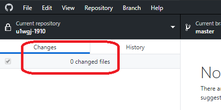

# ゲームプログラミング1年生
2019年度 デジタルアーツ東京 ゲームプログラミング1年生用リポジトリー。

- [シラバス](syllabus.md)

# 参考URL
- [日本語から変数や関数名の候補を示してくれるサービス](https://codic.jp/)
- [@shun-shun123. Csharp Coding Guidlines Unity Community 和訳](https://qiita.com/shun-shun123/items/212893b60b7f14c69351)
- [Microsoft. 識別子名、名前付け規則](https://docs.microsoft.com/ja-jp/dotnet/csharp/programming-guide/inside-a-program/identifier-names)
- [Microsoft. C#のコーディング規約](https://docs.microsoft.com/ja-jp/dotnet/csharp/programming-guide/inside-a-program/coding-conventions)

# DATフェスタ作業進捗メモ
- [進捗メモ](https://docs.google.com/document/d/1GFMHG6rj6f2-9--Jz8HVYilQsmuUml8x7-pcSpAhQ8w/)

# プロジェクト関連
- [GitHubの開発フロー](https://sketchboard.me/LBSAHzZ8ynEE)
- [Unityの命名規則とエディター設定](http://am1tanaka.hatenablog.com/entry/2019/12/06/101055)

## GreeningEx2019
- [GreeningEx2019 GitHub](https://github.com/dat19/GreeningEx2019)
- [GreeningEx2019 Trello](https://trello.com/b/GPOLuD8w/greening)

## HungraviyEx2019
- [HungraviyEx2019 GitHub](https://github.com/dat19/HungraviyEx2019)
- [HungraviyEx2019 Trello](https://trello.com/b/EMqUWKla/%E3%81%AF%E3%82%93%E3%81%90%E3%82%89%E3%81%B3%E3%81%83dat19)

# 後期11回目(1/10)
## 話題
- [Unity1週間ゲームジャムミートアップ](https://meetup.unity3d.jp/jp/events/1191)
  - 2020/1/18 12:00〜2020/1/18 16:00

## GreeningEx2019実行ファイル
- X:\2019年\ゲーム学科\Student\ゲームプログラム1年\GreeningEx2019 を開く
- GreeningExeフォルダーをデスクトップなどにコピーしてから、中のGreeningEx2019.exeをダブルクリックして起動

### 効果音の再収集
- [SEのリスト](https://trello.com/c/uXcrhIHf/63-se%E5%86%8D%E5%8F%8E%E9%9B%86)
- 不具合は[こちら](https://github.com/dat19/GreeningEx2019)にNew issueを作って書き込む
- [スタッフクレジット表記の相談](https://docs.google.com/document/d/1PFBqRFqpQgoFrXS6HmB4NU7HENSnek2J_J0Pq97WNzE/edit?usp=sharing)

## 残りの期間でやりたいこと
- GreeningEx2019を完成させて、2年生が制作するCDに同梱する
- 今後のテーマについての調査(正月課題)
- ポートフォリオWebページの作成
- 1年生の総復習
- 卒業制作に向けた企画会議
- 2時間ゲームジャム

## 正月休み課題 発表
### ゲームプログラミング
以下について調べて、正月明けに発表する。

- マイナビやpaizaの新卒採用の情報などに目を通して、どのようなプログラミング言語やフレームワークの募集が多いかを調べる
- 自分が興味を持った企業2社、プログラミング言語、フレームワーク(あれば)を挙げる
- 上記で挙げたプログラミング言語やフレームワークを勉強できるWebサイトを探して(参考： https://paiza.jp/works )、少し進めてみて、どのようなものかを簡単にまとめる

以上3点を行い、5分程度で簡潔に発表できるようにWordやPowerpoint、Googleドキュメントなどにまとめる。1～2ページでよい。

### ゲームデザイン実習
前期に学んだゲームの企画の作成方法と、後期のこれまでに体験したこと、[ゲームプログラミングの課題](https://github.com/dat19/gp1/blob/master/README.md#%E6%AD%A3%E6%9C%88%E4%BC%91%E3%81%BF%E8%AA%B2%E9%A1%8C)の調査結果を元に、ゲームやサービスの企画提案書を作成する。正月明けに、一人持ち時間10分でプレゼンする。

- これまで作成した企画でも、新規の企画でも構わない
- Unity以外でもよいし、ゲーム以外のものでもよい
- タイトル、サムネイル、画面のモックアップのスクリーンショット、作品のコアステートメント、対象としているプレイヤーや利用者、プラットフォーム、解像度、操作方法、ルール(ゲーム以外なら不要)、ゲームの導入のストーリー(あれば)、モックアップの作成に利用したアセットがあればアセットのURL
- 以上を、Word、Powerpoint、Googleドキュメント、Googleスライド、なんでもよいので作成してくる
- 動作する必要はない
- [例](https://docs.google.com/presentation/d/1tVwSTsw2X3EIK4MDuRgiEHZn-Yux5Vbjy0RfMeZLKeo/)

2つの課題を、 持ち時間最大15分までで発表。短くても構わない。


## Greeningの目標
- 1/8 システム完成予定。ステージの制作 > ほぼ完成。残りの作業やバグを洗い出す
- 1/22 完成予定
- 1/29 2年の卒業制作に向けた総まとめと準備
- 2/5, 7で終了

### 現状確認
- [前回の様子](https://github.com/dat19/design#%E5%86%85%E5%AE%B9)
- 音の確認。効果音はほぼ探し直し

## カメラのアルゴリズム
- [GitHubでフォークしたUnityプロジェクトを丸ごと最新にする](https://docs.google.com/document/d/1HlV70sEMS8G3eLAD6YMuIObY7hei7YdaXKObGV9EpYg/)
- カメラの動きを作る
  - [作業手順](https://docs.google.com/document/d/1mbH1m0BrXeAOxH5OZuKc71xanlliSJX7H6LnYx7fjtA/)

## ステージ作成
- [ステージ作成](https://github.com/dat19/GreeningEx2019/blob/master/Documents/HowToEditStage.md)


# 後期10回目(12/20)
## プロジェクトの更新の前に
GreeningEx2019のプロジェクトフォルダーのAssetsフォルダーの中にある`PrivateResources`フォルダーを、以下の手順でコピーしてバックアップする。

- エクスプローラーで、 `X:\2019年\ゲーム学科\Student\ゲームプログラム1年\GreeningEx2019\1220` フォルダーを開く
- 新しいフォルダーを作成して、フォルダー名を自分の名前にする
- `PrivateResources`フォルダーを、作成した自分の名前のフォルダーにコピーして貼り付ける
- コピーが完了したら、ローカルの`PrivateResources`フォルダーを削除する

以上が完了したら、いつもの手順でプロジェクトを更新する。

- プロジェクトの更新
  - [プロジェクトの更新手順](https://github.com/dat19/design/wiki/GreeningEx2019%E3%81%AE%E6%9B%B4%E6%96%B0%E6%89%8B%E9%A0%86)
    - Systemシーンを開いてPlayして、状況を確認する
    - ステラのアニメを完備
    - ミニジャンプとたんぽぽバグの修正


## 正月休み課題
以下について調べて、正月明けに発表する。

- マイナビやpaizaの新卒採用の情報などに目を通して、どのようなプログラミング言語やフレームワークの募集が多いかを調べる
- 自分が興味を持った企業2社、プログラミング言語、フレームワーク(あれば)を挙げる
- 上記で挙げたプログラミング言語やフレームワークを勉強できるWebサイトを探して(参考： https://paiza.jp/works )、少し進めてみて、どのようなものかを簡単にまとめる

以上3点を行い、5分程度で簡潔に発表できるようにWordやPowerpoint、Googleドキュメントなどにまとめる。1～2ページでよい。この課題で調査した環境を使った企画を考えて、水曜日の[ゲームデザイン実習の課題](https://github.com/dat19/design#%E6%AD%A3%E6%9C%88%E4%BC%91%E3%81%BF%E8%AA%B2%E9%A1%8C-%E3%82%B2%E3%83%BC%E3%83%A0%E3%83%87%E3%82%B6%E3%82%A4%E3%83%B3%E5%AE%9F%E7%BF%92)に取り組むこと。

## 作業メモ
- [作業メモ](https://docs.google.com/document/d/1g5KUtxN5oj4-F52mjDkNiWyFQ2FbW78hpj3jflo6zy8/)

## 予定
- 正月休み課題について、マイナビやpaizaを確認
- プログラム解説
  - ミニジャンプの実装
    - ScriptableObject
    - 当たり判定を先読みするPhysics.BoxCastNonAlloc()
    - ジャンプ距離の算出
    - 状態を分けることで、操作の混乱を防ぐ
- 今日の作業
  - [タイトル画面のデザイン](https://trello.com/c/TWFgjZpD/) スズキ、ナミキ、ノザワ
    - 必要なもの
      - コピーライト Copyright (C) 2019-2020 DAT GreeningEx Team
      - バージョン Ver0.00 という文字を、タイトルの右下、或いは画面の右下。あまり目立たなくてよい
      - 「Push [Z] or [X] key」 → 「New Game」と「Continue」
        - 文字で表示
        - ボタンではない
        - 現在、選択している方の文字を明るく、そうでない方を暗くする。大きさを変えるのも良い
    - Font
      - [AR CHRISTY](https://fontzone.net/font-details/ar-christy)
      - PrivateResourcesフォルダーの中に、`Fonts`という名前のフォルダーを作成
      - 上記フォントをダウンロードして、作成したFontsフォルダー内に移動
      - TextMeshProのアセットを作成
      - 日本語は含まれないので、ASCIIで生成
  - BGMとSEを揃える(ショウジ、マエダ、ヨウダ)
  - [ステージ選択画面の島が奇麗になるアニメの作成](https://trello.com/c/HTQBQdoU) コバヤシ、マチダ
- 作業は必ずPushして、Create Pull Requestすること
  - 今日の時点で集まらなかったものは、原則としてボツ


# 後期9回目(12/13)
## 前回の振り返り
- マージ作業の分担を決める
  - [ステラのアニメーション分割](https://trello.com/c/3jiB3ybI/14-%E3%83%97%E3%83%AC%E3%82%A4%E3%83%A4%E3%83%BC%E3%81%AE%E8%A8%AD%E8%A8%88%E3%81%A8%E3%82%A2%E3%83%8B%E3%83%A1%E4%BD%9C%E6%88%90)
    - ジャンプ： JumpStart, Jump, Fall, Landing
    - たんぽぽ： DandelionStart, Dandelion, DandelionEnd
    - 苗をもつ： NaeUp, Nae(苗の終了は、NaeUpの逆再生)
    - 水やり：   WaterStart, Water, WaterEnd
  - [ツタ](https://trello.com/c/P51MFaNl/40-%E3%83%84%E3%82%BF)
  - [丸いの](https://trello.com/c/RJlTA9d1/46-%E4%B8%B8%E3%81%84%E3%81%AE)
  - [花の橋](https://trello.com/c/zIMxL95K/31-%E8%8A%B1%E3%81%AE%E6%A9%8B)
  - [きのこ](https://trello.com/c/fag4Rxu0/43-%E3%81%8D%E3%81%AE%E3%81%93)
  - [たんぽぽ](https://trello.com/c/T8j6YzFR/24-%E3%81%9F%E3%82%93%E3%81%BD%E3%81%BD)

## 予定
- 作業してきたデータをコミット > Push > Create Pull Request
- upstreamのプロジェクトを手元のプロジェクトにマージして更新する
  - [プロジェクトの更新手順](https://github.com/dat19/design/wiki/GreeningEx2019%E3%81%AE%E6%9B%B4%E6%96%B0%E6%89%8B%E9%A0%86)
  - プロジェクトを開いたら、Scenesフォルダー内のTestStageをダブルクリックして開く
- [苗の発芽について解説]()
  - ツタとキノコの実装を完了している。これをもとに他の発芽も実装する
- ステージ作成
  - すべての苗のサイズが決まったので、ステージ制作班を決めて、ステージの制作
  - Projectウィンドウで、StageEditorシーンを選んだら、[Ctrl]+[D]キーで複製する
  - 名前をStage01、Stage02などのようにつける
  - 複製して名前をStage??にしたシーンをダブルクリックして開く
  - Hierarchyウィンドウで、Mapオブジェクトの名前をシーンと同じ`Stage???`に変更
  - Playして、マップを作成する
  - マップができたら、停止する前に、HierarchyウィンドウのMapオブジェクトをドラッグして、Prefabsフォルダーにドロップして、プレハブ化する
  - 以上。ゴールは、Prefabsフォルダーから、Goalをドラッグして、Sceneビューにドロップして配置。Z座標を0にしておくこと
- 各自、作業
  - ステージ
  - [x] たんぽぽの綿毛(マチダ、マエダ)
  - [x] 花の橋(オオヤ)
  - 丸い岩(ヨウダ、シン)
  - [x] タイトルシーンの画面作成(オリジナルのを参考にする) (ナミキ、ノザワ)
  - ステージ選択画面の作成(オリジナルのを参考にする)(ナミキ、ノザワ)
  - ジョウロから出る水のエフェクトの調査。何か良い方法はないかをアセットストアやWebで調べる(コバヤシ、ショウジ)
  - マージ(田中)

## 今後の作業
- プレイヤーの作成
  - Inputを定義する
  - 水まき


# 後期8回目(12/6)
## 話題
- [ITmedia. 「これさぁ、悪いんだけど、捨ててくれる？」――『ジャンプ』伝説の編集長が、数億円を費やした『ドラゴンボールのゲーム事業』を容赦なく“ボツ”にした真相](https://www.itmedia.co.jp/business/articles/1912/06/news020.html)
- [Unityの命名規則とエディター設定](http://am1tanaka.hatenablog.com/entry/2019/12/06/101055)

## 作業メモ
- [作業メモ](https://docs.google.com/document/d/1oQWzM7XYrib6Nv2muuN4C2s1AB7JUU0Sd4puM_nnx_0/)

## 内容
- 仮の水を作成
  - Sphereを作成して、TagとLayerをWaterにする
  - マウスをクリックした場所に、水を生成する仮のスクリプトを作成
  - 一定時間が経過すると消えるようにする
- 作業の分担を決める
  - [ステラのアニメーション分割](https://trello.com/c/3jiB3ybI/14-%E3%83%97%E3%83%AC%E3%82%A4%E3%83%A4%E3%83%BC%E3%81%AE%E8%A8%AD%E8%A8%88%E3%81%A8%E3%82%A2%E3%83%8B%E3%83%A1%E4%BD%9C%E6%88%90)
    - ジャンプ： JumpStart, Jump, Fall, Landing
    - たんぽぽ： DandelionStart, Dandelion, DandelionEnd
    - 苗をもつ： NaeUp, Nae(苗の終了は、NaeUpの逆再生)
    - 水やり：   WaterStart, Water, WaterEnd
  - [ツタ](https://trello.com/c/P51MFaNl/40-%E3%83%84%E3%82%BF)
  - [丸いの](https://trello.com/c/RJlTA9d1/46-%E4%B8%B8%E3%81%84%E3%81%AE)
  - [花の橋](https://trello.com/c/zIMxL95K/31-%E8%8A%B1%E3%81%AE%E6%A9%8B)
  - [きのこ](https://trello.com/c/fag4Rxu0/43-%E3%81%8D%E3%81%AE%E3%81%93)
  - [たんぽぽ](https://trello.com/c/T8j6YzFR/24-%E3%81%9F%E3%82%93%E3%81%BD%E3%81%BD)

## 今後の作業
- 花のトランポリン
- プレイヤーの作成
  - 棒立ち、落下、左右移動、水まき
  - Inputを定義する
  - CharacterControllerによるキャラクター制御

# 後期7回目(11/29)
## 準備手順
- GitHub Desktopを起動して、Fetchボタンを押して、Pullに表示が変わったらPullボタンを押す
- RepositoryメニューからShow in Explorerを選んで、フォルダーが開いたら`CopyPrivateResources.bat`をダブルクリックしてデータを更新する
- Unity Hubを起動して、GreeningEx2019を選択して読み込む

## 内容
- ステージエディター作成
- プレイヤーの作成
  - 設定の確認
  - 設定から、動作状態とアニメ状態を定義
  - アニメーションの取り出し
    - X:\2019年\ゲーム学科\Student\ゲームプログラム1年\GreeningEx2019

# 後期6回目(11/22)
## 作業メモ
- [作業メモ](https://docs.google.com/document/d/1cOY96TS3fVYC0MXA7Bs05WDlig_9s_6l8OJy5jT_MQw/)

## 予定
- GitHubでの作業イメージ
  - https://sketchboard.me/LBSAHzZ8ynEE
- Greeningのプロジェクトを各自、ダウンロードして、セットアップする
- 命名規約について
  - [@shun-shun123. Csharp Coding Guidlines Unity Community 和訳](https://qiita.com/shun-shun123/items/212893b60b7f14c69351)
  - [今回のプロジェクトでの命名規約](https://docs.google.com/document/d/10DWSrp2QcdawOtBvM67lr8Sjv1disyUshkcp0mc_B5U/edit)
- 作業の概要を確認する
  - [GreeningEx2019](https://trello.com/b/GPOLuD8w/greening)
  - [HungraviyEx2019](https://trello.com/b/EMqUWKla/%E3%81%AF%E3%82%93%E3%81%90%E3%82%89%E3%81%B3%E3%81%83dat19)
- モデルのマテリアルとテクスチャーの設定
  - Autodesk Maya2018を起動
  - ファイルメニューから新規シーンを選択して、新規シーンにする
  - 確認したいFBXファイルをMAYAのメインウィンドウにドラッグ&ドロップ
  - テクスチャーアイコンをクリックして、[F]キーを押す
  
  - 以上で本来の画像が表示されるので、色を参考にしながらテクスチャーや色味をUnity側で設定する
  - 完了したら、新規シーンにして、次のモデルデータの作業を進める


# 後期5回目(11/1)
## DATフェスタに向けて、どういう形で展示ができるかを検討する
- 未完成でも、説明する人間がいれば展示はできる
- 来た人に何が提供できるか？
- 作っておくとより良く展示できるものはないか？

## 予定
- DATフェスタ準備
  - 夏休み課題のうち、展示可能な作品候補
    - コバヤシ. くまごろう
    - タカシマ. Slide Step
    - ハラダ 階段のやつ
    - マエダ. NEW SUPER
  - 展示用パネルの作成
    - 操作説明、製作者名、操作方法、ルール、制作期間、制作ツール(Unity)、使用アセットリストをA4の紙にまとめる
- DATフェスタ作業
  - こちらも展示用パネルは必要

# 後期4回目(10/25)
## 内容
- DATフェスタ準備
  - 夏休み課題のうち、展示可能な作品候補
    - コバヤシ. くまごろう
    - タカシマ. Slide Step
    - ハラダ
    - マエダ. NEW SUPER
  - 展示用パネルの作成
    - 操作説明、製作者名、操作方法、ルール、制作期間、制作ツール(Unity)、使用アセットリストをA4の紙にまとめる
- DATフェスタ作業
  - こちらも展示用パネルは必要


## 注意!!
- GitHubを利用する場合、**小まめにCommit**すること!!
  - Commitは、gitに状態を保存するSaveの役割
  - Commitしておけば、その状態に戻すことができる
  - Saveをしないで変更を続けるのが危険であることと同じく、Commitしないで作業を続けるのは危険
- ブランチの切り替え前には、必ず**Changesを0**にしておくこと!!




# 後期3回目(10/18)
## 内容
- 水曜日の続き
  - ぐらびぃが画面外に押し出されないようにする
- [講義メモ](https://docs.google.com/document/d/1X8rD25ABrdIkx3fgd50whMwLHDF-inGZNE1vte1tAeA/)
- VisualStudio Share Linkでコード開発
  - X:\2019年\ゲーム学科\Teacher\tanaka\ をエクスプローラーで開く
    - 前回のhungravy-dat1910フォルダーは削除してよい
    - `hungravy-dat19-1016.zip`をコピーして、自分のPCのドキュメント > 自分のフォルダーに貼り付ける
    - 貼り付けた`hungravy-dat19-1016.zip`を右クリックして、*7-Zip* > *ここに展開*を選択
    - Unityで展開したフォルダーを開く
  - [ここを右クリック](https://docs.google.com/document/d/1c3dBetv3anGAJldW0cCL02Yp3dt-gqhRxbf526TJasA/)して、新しいタブで開く
  - *使い方* に従って、共有をする


# 後期2回目(10/11)
## 内容
- 水曜日の続き
- 順番は平田君から
- [講義メモ](https://docs.google.com/document/d/1X8rD25ABrdIkx3fgd50whMwLHDF-inGZNE1vte1tAeA/)
- VisualStudio Share Linkでコード開発
  - X:\2019年\ゲーム学科\Teacher\tanaka\ をエクスプローラーで開く
    - `hungravy-dat19-1009.zip`をコピーして、自分のPCのドキュメント > 自分のフォルダーに貼り付ける
    - 貼り付けた`hungravy-dat19-1009.zip`を右クリックして、*7-Zip* > *ここに展開*を選択
    - Unityで展開したフォルダーを開く
  - [ここを右クリック](https://docs.google.com/document/d/1c3dBetv3anGAJldW0cCL02Yp3dt-gqhRxbf526TJasA/)して、新しいタブで開く
  - *使い方* に従って、共有をする


# 後期1回目(10/4)
- [講義メモ](https://docs.google.com/document/d/1sHsAW1idQAj1isUpyB1c_IKq0NCmNcq75NrK2a1sYEI/)

## 内容
- プログラミングトレーニング： [はんぐらびぃの改良](https://github.com/dat19/gp1/wiki/%E3%81%AF%E3%82%93%E3%81%90%E3%82%89%E3%81%B3%E3%81%83%E3%81%AE%E9%96%8B%E7%99%BA%E3%81%AB%E5%8F%82%E5%8A%A0%E3%81%99%E3%82%8B)
- DATフェスタ作品開発: もくもく会方式
  - 今日の予定の発表
  - ツイキャスで成果報告

## Visual Studio LiveShareのインストール
- [コード共有の準備](https://docs.google.com/document/d/1c3dBetv3anGAJldW0cCL02Yp3dt-gqhRxbf526TJasA/)
  - 参考URL https://docs.microsoft.com/en-us/visualstudio/liveshare/reference/manual-join
- 一度に5人までなので、作業順番に合わせて共有し、作業が終わったら共有を終えること
  - VSが使えなったら、 https://codeshare.io/ を利用

---

# 15週目(9/13)
## 予定
- DATフェスタの企画会議
- ビルドが必要な作品のビルドと配布
  - プレイ動画
- unityroomに登録した作品に、「デジタルアーツ東京」のタグ付け(任意)
- 夏休み課題のプロジェクトの提出
  - `X:\2019年\ゲーム学科\Student\ゲームプログラム1年\夏休み課題`を開く
  - 新規にフォルダーを作成して、フォルダーの名前を自分の名前に変更する
  - そのフォルダーの中に夏休み課題のUnityプロジェクトのフォルダーを丸ごとコピーする
- [paizaラーニング　スキルチェック](https://paiza.jp/challenges/info)

# 14週目(9/6)
## 内容
- 発表順抽選
- 評価シートを作成
  - Googleドライブを開いて、ログイン
  - 新規をクリックして、Googleスプレッドシートを選択して、新規にスプレッドシートをして、タイトルを**0906プレゼン評価**にする
  - [評価シートひな形](https://docs.google.com/spreadsheets/d/1maaHJSCrIqVMrcoy8kyYZ7cxIF9xpQjRTaYDVGS64rs/edit?usp=sharing)を開く
  - [Ctrl]+[A]キーですべて選択して、[Ctrl]+[C]キーでコピー
  - 先ほど作成した0906プレゼン評価に切り替えて、[Ctrl]+[V]キーで貼り付け
  - 列幅を調整
  - 共有可能にして、以下にURLを貼り付ける
    - https://docs.google.com/spreadsheets/d/1Ky6bU27vJy_jl4-Yu3UiaHj-ZuHUPcQHXOVgjsRn-Mc/edit?usp=sharing
- 発表準備
  - TwitCastingでライブストリーミングの準備
    - 水曜日にインストールしたTwitCastingのデスクトップアプリをスタートメニュー > twitで検索して起動
      - 未インストールの場合、[ここ](http://twitcasting.tv/tdl_download.php)を開いて、ダウンロードして実行 > 規約を承諾してインストールする
    - Explorerを開いて、以下をバスにコピペして開いて、各項目を設定してください
      - Z:\2019年\ゲーム学科\Teacher\tanaka\twitcasting.txt
    - [手順](https://docs.google.com/document/d/1KA8AbOhcG2-eG0nhPJR02losYx-YCMQSuum2xWQfLwM)
- 夏休み課題の発表
- DATフェスタ企画会議(1)


# 1週間ゲームジャムに向けてのリンク集
- https://unityroom.com/unity1weeks
  - ページの下の方に大変助かる記事へのリンクあり
- [寸前みやこ. 気軽に参加できるゲーム制作のコンテスト unity1week](https://szmiyako.blogspot.com/2019/06/unity1week.html)

## 企画：　今回は面白くなくてもよい！
- [テラシュールブログ. はじめてゲーム開発する前に知っておくべきこと](http://tsubakit1.hateblo.jp/entry/2018/07/30/223410)

### 面白くしようとする時のヒント（完成してからで）
- [DeNA. DeNA現役プランナーによる『ゲームプランナーの教科書』を9スライド公開！ 良いゲームはおもしろさの因数分解から生まれる](https://fullswing.dena.com/archives/726)
- [かえるD. なぜ作ったゲームが面白くならないのか？基礎にして奥義「フロー理論」](https://note.mu/kaerusanu/n/nc80f9523bb8e)
- [［GDC 2019］ゲームメカニクスだけに依存しない，面白いゲームの作り方。その技術を支える「6つの動詞」とは](https://www.4gamer.net/games/999/G999905/20190321021/)
- https://unityroom.com/games/metrotree
  - プリミティブなものをセンスでまとめた例
- https://unityroom.com/games/tunagirl
  - シンプルでも評価を得られる例

## 画面設計
- [Anna Mészáros. デザイナーではない人がデザインする上で大切な4つの基本原則](https://gigazine.net/news/20190518-fundamental-design-principles/)
- [coliss. 2019年用、日本語のフリーフォントまとめ -商用サイトだけでなく紙や同人誌などの利用も明記](https://coliss.com/articles/freebies/japanese-free-fonts-for-2019.html)
- [フォントの試し書き](https://tameshigaki.jp/)
- [カラースキームジェネレーター](https://coolors.co/)
- [PHOTOSHOPVIP. 現役デザイナーが教える！完璧な書体を決める10個の黄金ルールまとめ](http://photoshopvip.net/105840?utm_content=bufferf79a8&utm_medium=social&utm_source=twitter.com&utm_campaign=buffer)
- [個人開発のUI設計術](https://crieit.net/posts/UI)
- https://www.fontsquirrel.com/
  - アプリ埋め込みが可能なものから検索などが可能な英語フォント紹介サイト

## オーディオ
- [Unity Technologies Japan. クリックするだけで効果音を自動生成する「bfxr」](http://inter-high-blog.unity3d.jp/2017/08/09/bfxr/)
  - [効果音作成ツールBfxr](http://www.bfxr.net/)
- [AudioCutter. MP3などをトリミングできるサイト](https://mp3cut.net/ja/)
- [Audacity](https://forest.watch.impress.co.jp/library/software/audacity/)
  - オーディオファイルを編集するフリーウェア。編集 -> クリップの境界で分割すると、プチノイズを発生させずにトリミングができるので便利

# 13回目(7/13)
## 話題
- [「声優志望者は専門学校にも養成所にも行くな！」音響監督・長崎行男と福原慶匡Pが明かす、声優業界のいま](https://mobile.twitter.com/AnimeAnime_jp/status/1151092153533292544)
- [松本保典. ツイート](https://mobile.twitter.com/ryouta3527/status/1150781112693579776)
  - どちらも、「声優」を「ゲームプログラマー」に置き換えて読んでみる
- [結城浩. ツイート](https://twitter.com/hyuki/status/1151844716259901440)

## 予定
- 夏休み課題の説明
- コード解説
  - http://baba-s.hatenablog.com/entry/2018/01/16/212800#%E3%83%91%E3%83%89%E3%83%AB%E3%81%AE%E6%93%8D%E4%BD%9C より

```cs
using UnityEngine;

public class BallController : MonoBehaviour
{
    public float speed = 10;

    private void Start()
    {
        var force = ( transform.forward + transform.right ) * speed;
        GetComponent<Rigidbody>().AddForce( force, ForceMode.VelocityChange );
    }
}
```

- Unityでのゲーム開発振り返り
  - https://docs.google.com/document/d/11Pi1cHxEv9W4LgmaHWaMvzOstUx7Q7EToXM-wzKrGXQ/edit
  - https://docs.google.com/document/d/1i08IrTyWiTv9B9zjFv2iUQBv-MXb8BYUzv_QVSukdPo/edit#heading=h.b30mdk84mkr4

## 夏休みの課題
### 作品チュートリアル例
- [初心者向け](https://www.udemy.com/unity-chan-tutorial-01/)
- [倉庫番. データを使うのでプログラミングのトレーニングにおすすめ](http://baba-s.hatenablog.com/entry/2018/03/30/085000)
- [Udemyの無料で学習できる素材](https://www.udemy.com/topic/unity/?instructional_level=beginner&instructional_level=intermediate&p=1&price=price-free&sort=popularity&subcategory=Game+Development&subcategory=Game+Design)
- [初心者向けが多い(少々コードが微妙なところがある](https://hiyotama.hatenablog.com/)

### 前期の復習
- 全ての講義について、何をやったのかを振り返り、わからなかった部分は調べたり、繰り返し取り組んで理解を深める

### 一か所以上、オリジナル要素を入れた(ミニ)ゲームを完成させる
- よけとる、インターネットで見つけたチュートリアルブログ、自分で購入した書籍、学校にある書籍などに掲載されている作品を元にして、オリジナルの要素を1つ以上付け加えた作品を完成させる
- 完全オリジナルでもよい
- どこにオリジナル要素があるかを明確にすること
- 1週間ゲームジャム参加者はその作品の一部改造でよい

## 発表方法
- WebGL、PC、スマホなど、環境はなんでもよいのでビルドする
- GitHub Pagesなどでゲーム紹介と配信(配布)するWebサイトを作成
  - Webサイトの作成は[ゲームデザイン実習13回目](https://github.com/dat19/design/blob/master/README.md#13%E5%9B%9E%E7%9B%AE717)参照
- 上記を一人最大10分で発表
  - 発表用の資料は、パワポ、GitPitch、その他プレゼンツール、あるいはGitHub Pagesのみでの発表も可能

## 発表内容は主に以下の通り
- 作品を動かして簡単に紹介
- 作品の概要
- 操作方法
- ルール(ゲームオーバー、クリア、競う要素)
- 参考元のゲームの情報(書籍名、WebのURLなど)
- 自分で作成した個所の明示(どのファイルの何行目から何行目か)
- 利用したアセット一覧


# 12回目(7/12)
## 話題
- [Unity道場 ７月～ゲーム制作に使う数学を学習しよう～](https://meetup.unity3d.jp/jp/events/1122)
- [Unity アセット真夏のアドベントカレンダー 2019 Summer!](https://twitter.com/AssetStore_JP/status/1148730727099297793)
- [渋谷ゆに茶会 scene07](https://t.co/TCWNlN5jDz)


## 内容
- Unity Hubのアップデート
- [ネットランキング対応](https://blog.naichilab.com/entry/webgl-simple-ranking)
- ランキング画面が消えたことを確認
  - [作業手順](https://docs.google.com/document/d/1CZtUBApNSzVZaE0xcJ_niQt6kJ31NcXQfcYmPjUhaxo/edit?usp=sharing)
- WebGLビルドをして、unityroomで公開設定
- 公開作品の試遊会
  - Twitterでログインして、コメントと評価の投稿をしてあげてください
  - https://unityroom.com/games/dat19-gp129
  - https://unityroom.com/games/cactus_collect
  - https://unityroom.com/games/oto1_yatsuhashi
  - 参考：2年生作品 https://unityroom.com/games/ookami_youjyo_animal_get_together

## 作業


# 11回目(7/5)

## 復習
- [Unityでの操作、オブジェクトの作り方、動かし方、当たり判定](https://docs.google.com/document/d/11Pi1cHxEv9W4LgmaHWaMvzOstUx7Q7EToXM-wzKrGXQ/)
  - プレイヤーのキー操作
  - キャラクターの問題の起きにくい作り方
  - 動かし方
  - 当たり判定の考え方
  - オブジェクトの消し方
  - オブジェクトの生成

## 内容
- [今回の手順](https://docs.google.com/document/d/1i08IrTyWiTv9B9zjFv2iUQBv-MXb8BYUzv_QVSukdPo/)
- スコア管理
- 演習 - unityroomに登録-
- 各自作業

## 演習
- unityroomに登録
- WebGLビルドして、仮アップロード
- 限定公開して、アップロードしたURLを[こちら](https://docs.google.com/spreadsheets/d/1Ky6bU27vJy_jl4-Yu3UiaHj-ZuHUPcQHXOVgjsRn-Mc/edit?usp=sharing)に報告


# 10回目(6/28)
## 前回の続きから
- 前回休んだ人は、[これ](https://github.com/dat19/gp1/raw/master/yoketoru-cs-10start.zip)をダウンロードして、展開して、Visual Studio 2013で開く
- リレーコーディング続き
  - 前回のプロジェクト(yoketoru-cs)をVisual Studio 2013で開く
  - [手順](https://docs.google.com/document/d/1EPjZmUB977afCmrh1Ml-QCR2mTnzcgjnYOGWXDH_V9c/edit?usp=sharing)
  - [共有ソースコード](https://codeshare.io/aY90pn)
  - [順番](https://docs.google.com/spreadsheets/d/1tYqiUfsssgp7oIWSqJC9sXmB_HUqxlZE8DrQED6-QD0/)

## Unity版 習作ゲーム「よけとる」の開発(1)
- [作業手順](https://docs.google.com/document/d/1Ibw6kmMfjuUFrPauVILCL-xIN7H96D8e3DGoxZM__Po/)
- プロジェクトの作成
- WebGL用設定と初回ビルド
- GitHubにパブリッシュ
- 状態遷移 / シーンの作成

# 9回目(6/21)
## 前回の復習の提出結果(出席15名)
- 提出(13名)
- 跳ね返りまで出来ている(8名)
- 時間内に停止までできている(1名)

## 内容
- リレーコーディング
  - [こちら](https://github.com/dat19/gp1/raw/master/yoketoru-cs-start.zip)をダウンロードして、ドキュメントの自分のフォルダーにドラッグ＆ドロップして展開して開く
  - [手順](https://docs.google.com/document/d/1EPjZmUB977afCmrh1Ml-QCR2mTnzcgjnYOGWXDH_V9c/edit?usp=sharing)
  - [共有ソースコード](https://docs.google.com/document/d/1agbVz0qIq_m52e3DpY7_04CgnjELkNlhkU6lPTSMVe0/edit?usp=sharing)
  - [抽選](https://docs.google.com/spreadsheets/d/1tYqiUfsssgp7oIWSqJC9sXmB_HUqxlZE8DrQED6-QD0/)


# 8回目(6/14)
## 前回の復習の提出結果(出席16名)
- 提出(13名)
- パーフェクト(〇が5個以上ならOK) (4名)

## 前回の振り返りと復習(前回と全く同じ)
- fukusyu0614の名前でプロジェクト作成
- [GitHubに登録](https://github.com/dat19/gp1/blob/master/vs-github-entry.md)して、Publish
  - **2つ目のプロジェクトフォルダーを選択すると提出失敗になるので注意！！**
- 以下を設定
  - ラベル(Label)を1つ
  - タイマー(Timer)を設定して、動くようにする
  - classの宣言の直下に、以下を追加

```cs
int vx = -10;
int vy = -10;
```

  - timer1をダブルクリックして、以下のプログラムを追加

```cs
			label1.Left += vx;
			label1.Top += vy;
```

- ラベルが、ウィンドウの端で跳ね返るようにする
- ラベルにマウスカーソルが重なったら、タイマーを停止(`timer1.Enabled = False;`)にする
- 完成したらPush

## 予定
- [コントロールをプログラムで追加する](https://github.com/dat19/csharp-manual/blob/master/15.md)
  - 新規にensyu0614を作って、ラベルをスクリプトから作成
- たくさん動かす仕上げ
- すべてをfor文に対応させる
- たくさんオブジェクトを出してみる
  - [作業手順](https://docs.google.com/document/d/1tLiMFh_ptiwREACelAh5jdesD7nUNs88EbSazum6q68/)
- 状態遷移 / 総合復習：沢山のラベルを表示して全て取るゲームの開発


# 7回目(6/7)

## 前回の課題
- 講義の開始までに、前回のfukusyu0531の最新版を、GitHubにCommitして、Pushしてください

## 前回の復習の提出結果(出席10名)
- 提出(9名)
- パーフェクト(5名)

## 前回の振り返りと復習
- fukusyu0607の名前でプロジェクト作成
- [GitHubに登録](https://github.com/dat19/gp1/blob/master/vs-github-entry.md)して、Publish
  - **2つ目のプロジェクトフォルダーを選択すると提出失敗になるので注意！！**
- 以下を設定
  - ラベル(Label)を1つ
  - タイマー(Timer)を設定して、動くようにする
  - classの宣言の直下に、以下を追加

```cs
int vx = -10;
int vy = -10;
```

  - timer1をダブルクリックして、以下のプログラムを追加

```cs
			label1.Left += vx;
			label1.Top += vy;
```

- ラベルが、ウィンドウの端で跳ね返るようにする
- ラベルにマウスカーソルが重なったら、タイマーを停止(`timer1.Enabled = False;`)にする
- 完成したらPush

## 内容
- ラベルとマウスカーソルが重なる条件の作り方
- [乱数](https://github.com/dat19/csharp-manual/blob/master/12.md)
- [配列](https://github.com/dat19/csharp-manual/blob/master/13.md)
  - [開始プロジェクト](https://github.com/tanakaedu/fukusyu0607)
- [繰り返し](https://github.com/dat19/csharp-manual/blob/master/14.md)

# 6回目(5/31)
## 前回の提出結果(出席15名)
- 提出(15名)
- パーフェクト(10名)

## 前回の復習
- fukusyu0531の名前でプロジェクト作成
- [GitHubに登録](https://github.com/dat19/gp1/blob/master/vs-github-entry.md)して、Publish
  - **2つ目のプロジェクトフォルダーを選択すると提出失敗になるので注意！！**
- 以下を設定
  - ラベル(Label)を1つ
  - タイマー(Timer)を設定して、動くようにする
  - classの宣言の直下に、以下を追加

```cs
int vx = -10;
int vy = -10;
```

  - timer1をダブルクリックして、以下のプログラムを追加

```cs
			label1.Left += vx;
			label1.Top += vy;
```

- ラベルが、ウィンドウの端で跳ね返るようにする
- 完成したらPush

## 予定
- [分岐 続きから](https://github.com/dat19/csharp-manual/blob/master/08.md)
  - [おまけ switch文](https://github.com/dat19/csharp-manual/blob/master/09.md)
- [マウス入力](https://github.com/dat19/csharp-manual/blob/master/10.md)
- [分岐2](https://github.com/dat19/csharp-manual/blob/master/11.md)


# 5回目(5/24)
## 前回の提出結果(出席17名)
- 提出(11名)
- 1カ所間違い(2名)
- パーフェクト(0名)

## 前回の復習
- fukusyu0524の名前でプロジェクト作成
- [GitHubに登録](https://github.com/dat19/gp1/blob/master/vs-github-entry.md)して、Publish
  - **2つ目のプロジェクトフォルダーを選択すると提出失敗になるので注意！！**
- 以下を設定
  - ラベル(Label)を1つ
  - ボタン(Button)を4つ作って十字に配置
  - タイマー(Timer)を設定して、動くようにする
  - classの宣言の直下に、以下を追加

```cs
int vx = 0;
int vy = 0;
```

  - timer1をダブルクリックして、以下のプログラムを追加

```cs
			label1.Left += vx;
			label1.Top += vy;
```

- ボタンを押すと、ラベルが動くようにする
- 完成したらPush

## 予定
- [分岐(1) 跳ね返り処理](https://github.com/dat19/csharp-manual/blob/master/08.md)
- [マウス操作](https://github.com/dat19/csharp-manual/blob/master/10.md)
- [ベクトルについて 続き](https://docs.google.com/document/d/1bptMOCYRdX4_IP8uhToeYloXgRh7C9v-nC1yLI8EFSE/)

# 4回目(5/17)
## Google Chromeの拡張機能Click&Cleanを削除する
- Chromeアイコンを右クリックして、Google Chromeを選択して、通常のChromeを起動
- アドレスバーに chrome://extensions/ を入力
- Click&Cleanの削除ボタンをクリック(なければすでに削除済みなので何もしなくてOK)
- Chromeを閉じる

## 前回の復習
- fukusyu0517の名前でプロジェクト作成
- [GitHubに登録](https://github.com/dat19/gp1/blob/master/vs-github-entry.md)して、Publish
- 以下を設定
  - ラベル(Label)を1つ
  - ボタン(Button)を4つ作って十字に配置
  - テキストボックス(TextBox)を2つ作って、両方とも`Text`プロパティーに`0`を設定
  - タイマー(Timer)を設定して、動くようにする
  - timer1をダブルクリックして、以下のプログラムを追加

```cs
			label1.Left += int.Parse(textBox1.Text);
			label1.Top += int.Parse(textBox2.Text);
```

- ボタンを押すと、ラベルが動くようにする
- 完成したらPush

## 今回の内容
- [変数](https://github.com/dat19/csharp-manual/blob/master/07.md)
  - TextBoxを不要にする
- 同様のことをUnityでやってみる
  - [ベクトルについて](https://docs.google.com/document/d/1bptMOCYRdX4_IP8uhToeYloXgRh7C9v-nC1yLI8EFSE/)

## その他
- 時間が余ったらタイピング練習。以下にスコアを報告せよ
  - [報告用のスプレッドシート](https://docs.google.com/spreadsheets/d/13IyWguSAEqxOa6fkID_B7BcLyzoe_1Lc3lRZKlJbXLk/edit?usp=sharing)


# 3回目(5/10)
## 水曜日のensyu0508リポジトリーの共有リンクを教えてください
- [書き込み先](https://docs.google.com/spreadsheets/d/1Ky6bU27vJy_jl4-Yu3UiaHj-ZuHUPcQHXOVgjsRn-Mc/)

## 前回の課題の総評
- パーフェクト：二人
- ボタン2つ：一人
- ボタン1つ：二人
- 未提出：四人
- 提出はできていて、ボタンの実装なし：上記以外


## 前回の復習
- 調べ方：実演
- fukusyu0510の名前でプロジェクト作成
- [GitHubに登録](https://github.com/dat19/gp1/blob/master/vs-github-entry.md)して、Publish
- ボタンを3つ作って、それぞれ違う動きをさせる
- 完成したらPush
- **パーフェクトやボタン2つの人は、担当列の人のサポートをしてください**

## 講義ノート
- [書く教科書 5から](https://github.com/dat19/csharp-manual/blob/master/05.md)、進められれば6まで
- [Unityでの物の動かし方](https://docs.google.com/document/d/1Su0trfKxB2iLfGdxt1s7pJr76NFwqwdw-pbDhaCrtvE/)

# 2回目(4/26)
## 講義ノート
- [書く教科書](https://github.com/dat19/csharp-manual)

## プロパティを調べる
- BackColor
- Enabled
- Font
- ForeColor
- Location
- Size
- Text
- TextAlign
- Visible

## 予定
- Visual Studioの基本操作
- プロパティの確認
- [タイピング練習](https://www.e-typing.ne.jp/)
  - 結果をこちらに報告

## 演習
- 新規にプロジェクト`ensyu0426`を作成して、以下について実装せよ
  - Gitでの管理を開始して、GitHubにPublishする
    - GitHub Desktop をダブルクリックして起動
    - Fileメニューから、Optionsをクリック
    - GitHub.comがサインイン済みの時は、Sign outをクリックする
    - Sign in ボタンをクリックして、GitHubアカウントでサインイン
    - FileメニューからNew Repository(リポジトリー)
    - Local pathのChooseボタンをクリック
    - ドキュメント > 名前のフォルダー > ensyu0426を開いて、フォルダーの選択をクリック
    - Local pathの最後のフォルダー名を選択して、切り取って、Name欄に貼り付け
    - Initialize this repository with a README にチェック
    - Git ignore欄をクリックして、`vi`と入力して、VisualStudioを選択
    - Create repositoryボタンをクリック
    - 右上のPublish repositoryボタンをクリック
    - Keep this code private のチェックを外す
    - Publish repositoryボタンをクリック
  - ボタンを3つ作成する
  - 作成した3つのボタンそれぞれに、押すと「文字が変わる」「場所が移動する」「消える」以外の変化をさせるプログラムを作成せよ
  - プロジェクトをGitHubに登録する
  - コミット＆プッシュ(これで提出になる)

# 1回目(4/19)
## 講義ノート
- https://docs.google.com/document/d/1WEDoUQOGek-jf9WwRDZmWhnGAj3DT1KxGFj6GRGQpkU/

## 予定
- ガイダンス - [シラバス](syllabus.md)の確認
- Visual Studioを試す
  - 起動 / プロジェクト作成 / ボタンの配置 / メッセージの表示
- Unityを試す
  - アカウント作成 / 起動 / プロジェクト作成 / オブジェクトの作成 / 着色 / メッセージの表示 / マウス操作
- 独習
  - [Paizaラーニング C#](https://paiza.jp/works/cs/primer)
    - アカウントをGitHubで登録する
  - [ドットインストール Unity入門(2018.3.4f1)](https://dotinstall.com/lessons/basic_unity_v2)
とUnityを触る / 学習サイトについて
- [タイピング練習](https://www.e-typing.ne.jp/)

## 演習
- タイピングの結果を報告する
  - [報告用のスプレッドシート](https://docs.google.com/spreadsheets/d/13IyWguSAEqxOa6fkID_B7BcLyzoe_1Lc3lRZKlJbXLk/edit?usp=sharing)
